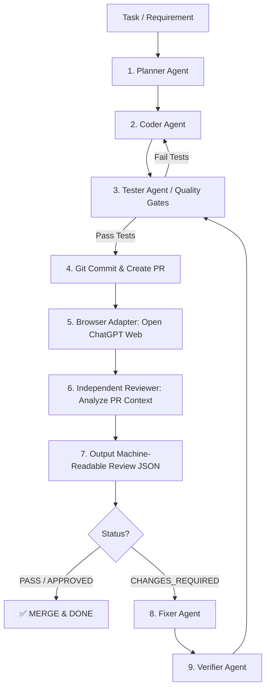

# Autonomous Code & Review Skill for Antigravity

Một Bộ Skill (Skill Package) tự động hóa quy trình lập trình và phản biện code nâng cao dành cho **Antigravity (Gemini 3.7 Flash / Flash High)** kết hợp với **ChatGPT Web (Reviewer Độc Lập)**.

---

## 🌟 Triết lý Thiết kế (Design Philosophy)

Khác với quy trình AI Code thông thường (AI tự viết -> tự khen), Skill này triển khai mô hình **Builder vs. Independent Reviewer**:
- **Builder (Gemini 3.7 Flash in Antigravity)**: Đóng vai Planner, Coder, Tester, Fixer. Code tốc độ cực nhanh, bám sát requirement.
- **Independent Reviewer (ChatGPT Web)**: Đóng vai Senior Architect & Security Auditor độc lập. Đánh giá khách quan, trả về kết quả định dạng **Machine-Readable JSON**.
- **Quality Gates & Guardrails**: Giới hạn tối đa `MAX_REVIEW_ROUNDS = 5` và `MAX_AUTO_FIX_ROUNDS = 3`. Nếu sau 5 vòng vẫn còn lỗi Blocker -> Dừng tự động để tránh lặp vô hạn (Infinite Hallucination Loop).

---

## 📐 Kiến trúc Workflow (Pipeline)



---

## 📁 Cấu trúc Thư mục Skill

```
autonomous-coding/
├── SKILL.md                          # Entry point của Skill cho Antigravity (/auto-code)
├── config.yaml                       # Cấu hình Quality Gates, Iteration limits, Adapters
├── agents/                           # Định nghĩa các Role Agent chuyên biệt
│   ├── planner.md                    # Agent lập kế hoạch thi công
│   ├── coder.md                      # Agent viết code & refactor
│   ├── tester.md                     # Agent chạy test, lint, static check
│   ├── reviewer.md                   # Agent quy định tiêu chí Review
│   ├── fixer.md                      # Agent đọc JSON review và sửa chính xác file/line
│   └── verifier.md                   # Agent xác nhận lại kết quả sửa
├── prompts/                          # Prompt templates & JSON Schema
│   ├── coding.md
│   ├── review-prompt-template.md     # Prompt ép ChatGPT xuất ra đúng JSON Schema
│   ├── review-schema.json            # Machine-Readable JSON Schema cho Reviewer
│   └── fix.md
├── policies/                         # Bộ quy chuẩn & Quality Gates
│   ├── quality-gates.md              # Tiêu chí dừng / PASS
│   └── go-backend-checklist.md       # Checklist chuyên sâu Backend (Go/Postgres/Kafka/Redis)
├── adapters/                         # Lớp Adapter hỗ trợ đa nền tảng Reviewer
│   ├── reviewer-interface.md         # Trừu tượng hóa giao diện Reviewer
│   ├── chatgpt-web-adapter.md        # Kịch bản tự động hóa Browser Subagent điều khiển ChatGPT Web
│   └── api-adapter.md                # Fallback qua API nếu cần
└── scripts/                          # Script tự động hóa (PowerShell & Bash)
    ├── collect-diff.ps1 / .sh        # Thu thập git diff và context PR
    ├── run-tests.ps1 / .sh           # Thực thi test & lint local
    └── review-loop.ps1 / .sh         # Xử lý vòng lặp orchestrator
```

---

## ⚡ Hướng dẫn cài đặt & Thao tác

### 1. Cài đặt vào Antigravity Workspace
Copy thư mục này vào dự án của bạn tại đường dẫn `.agent/skills/autonomous-coding/` hoặc đặt vào thư mục Skill cá nhân.

### 2. Sử dụng Command
Trong giao diện Antigravity, kích hoạt workflow bằng lệnh:

```bash
/auto-code Implement idempotency protection for CreatePolicyTVN endpoint.
```

---

## 🛡️ Quality Gates Standard (Tiêu chuẩn duyệt code)
Một PR chỉ được coi là **PASS** khi thỏa mãn đồng thời:
1. `Build`: Pass 100%
2. `Unit & Integration Tests`: Pass 100%
3. `Lint & Typecheck`: 0 Error
4. `Reviewer Status`: `APPROVED`
5. `Security & Blocker Issues`: 0 High/Critical Severity issues.
